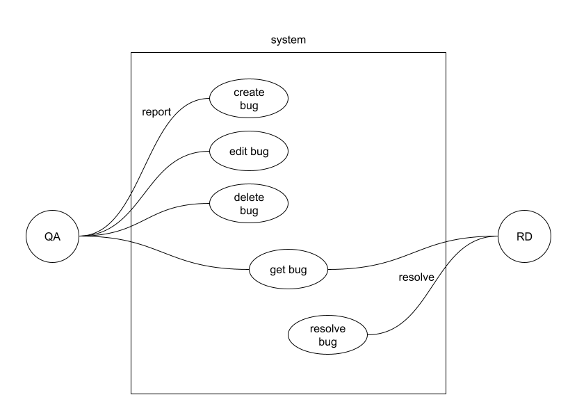
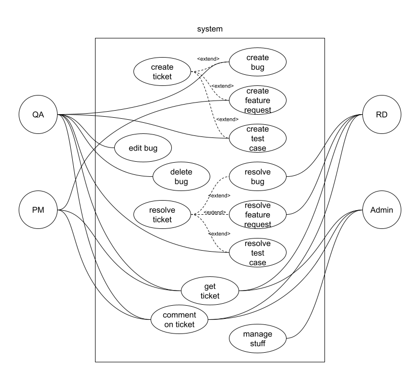
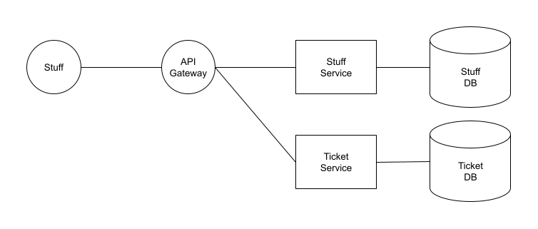
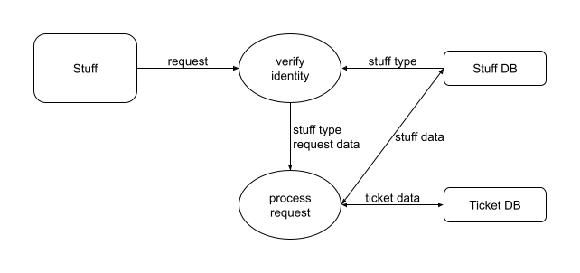
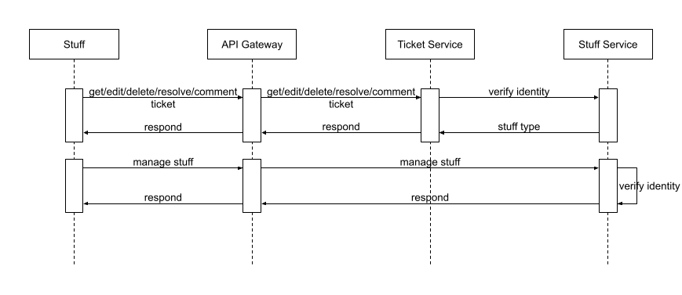

# Document

## Catalog

  - [Task](#task)
    - [Description](#description)
    - [Requirement](#requirement)
    - [Task](#task-1)
    - [Note](#note)
  - [Use Cases](#use-cases)
    - [Phase I](#phase-i)
    - [Phase II](#phase-ii)
  - [Cloud System Architect - multiple micro-services](#cloud-system-architect---multiple-micro-services)
    - [System Diagram](#system-diagram)
    - [Data Flow Diagram](#data-flow-diagram)
    - [Sequence Diagram](#sequence-diagram)
  - [Installation](#installation)
  - [Preview](#preview)
    - [Phase I](#phase-i-1)
      - [Run ticket service](#run-ticket-service)
      - [Serve front-end](#serve-front-end)
  - [Build](#build)
    - [Phase I](#phase-i-2)
      - [Compile ticket service](#compile-ticket-service)
  - [Deploy](#deploy)
    - [Kubernetes on Docker](#kubernetes-on-docker)

----------------------------------------------------------------------------------------------------

## Task

### Description

Please design a SaaS based ticket tracking system. This system allows QA to report a bug and RD can mark a bug as resolved.

### Requirement

- Phase I Requirement:
    - There are two types of user: QA and RD.
    - Only QA can create a bug, edit a bug and delete a bug.
    - Only RD can resolve a bug.
    - Summary field and Description filed are must have of a bug when QA is creating a bug.

- Phase II Requirement:
    - All the users can leave any comments below a ticket.
    - Adding new field Severity and Priority to a ticket.
    - Adding new type of user "PM" that can create new ticket type "Feature Request". And only RD can mark it as resolved.
    - Adding new ticket type "Test Case" that only QA can create and resolve. It's read-only for other type of users.
    - Adding Administrator user that can manage all the staffs including adding new QA, RD and PM user.

### Task

- Task 1 - Please write down all the use cases either in text or diagram you can think for Phase I and Phase II requirement separately.
 
- Task 2 - Think of yourself as a cloud system architect. How will you design such system based on multiple micro-services? Please write down the design document at least to include system diagram, data flow diagram and sequence diagram across services.

- Task 3 - Please implement the A. Phase I Requirement by Java 11 + Spring Boot in back-end. For front-end, you can use any framework you like.

- Task 4 - Pack your services as Docker container images. And deploy them onto one of any Kubernetes platforms such as AKS, EKS or GKE …etc, even more minikube or the standalone Kubernetes in Docker Desktop.
 
- Task 5 - Deploy your micro-services with one of any Service Mesh frameworks which supports not only Load Balancing but also Traffic Shifting mechanisms.

### Note

- Note 1: You do not need to finish all of the tasks, but please do your best to complete as much as you can.

- Note 2: Requirements may not be very clear, but please do your best to finish them.

- Note 3: (Optional) Technical requirements is listed below do your best to include the following modules as much as you can.

    1.	Spring Boot with the following latest version
https://docs.spring.io/spring-boot/docs/2.6.2/reference/htmlsingle/

    2.	Use Maven as your project management tool
https://maven.apache.org

    3.	You can choose any type of Database without limitation like SQL or NOSQL. But please apply to Spring Data for the Data Access Object.
http://projects.spring.io/spring-data/ 

    4.	You can pack your Java application easily with jib-maven-plugin.
https://github.com/GoogleContainerTools/jib/tree/master/jib-maven-plugin

    5.	If you have no idea on determining the Service Mesh framework, Istio will be a good choice of it.
https://istio.io/latest/docs/setup/getting-started/

----------------------------------------------------------------------------------------------------

## Use Cases

### Phase I



### Phase II



----------------------------------------------------------------------------------------------------

## Cloud System Architect - multiple micro-services

### System Diagram



### Data Flow Diagram



### Sequence Diagram



----------------------------------------------------------------------------------------------------

## Installation

- [Java JDK](https://www.oracle.com/java/technologies/downloads/#java11)
- [Vue CLI](https://cli.vuejs.org/guide/installation.html)
- VSCode extensions
  - Extension Pack for Java
  - Debugger for Java
  - Maven for Java
  - Language Support for Java(TM) by Red Hat
  - Spring Boot Dashboard
  - Spring Boot Tools
  - Spring Initializr Java Support
- [Istio](https://istio.io/latest/docs/setup/getting-started/#download)

----------------------------------------------------------------------------------------------------

## Preview

### Phase I

#### Run staff service

```
cd src\phase_1\staff_service
mvnw spring-boot:run
```

#### Run ticket service

```
cd src\phase_1\ticket_service
mvnw spring-boot:run
```

#### Serve front-end

```
cd src\phase_1\frontend
npm run serve
```

----------------------------------------------------------------------------------------------------

## Build

### Phase I

#### Compile staff service

```
cd src\phase_1\staff_service
mvnw compile jib:build
```

#### Install staff service

```
cd src\phase_1\staff_service
mvnw clean install
```

#### Compile ticket service

```
cd src\phase_1\ticket_service
mvnw compile jib:build
```

----------------------------------------------------------------------------------------------------

## Deploy

### Add namespace
```
kubectl create namespace tts-p1
kubectl label namespace tts-p1 istio-injection=enabled
```

### Kubernetes on Docker

```
cd src\phase_1
kubectl apply -f tts-p1.yaml 
kubectl apply -f tts-p1-getway.yaml
```